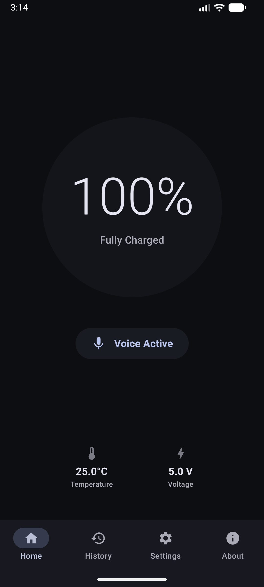
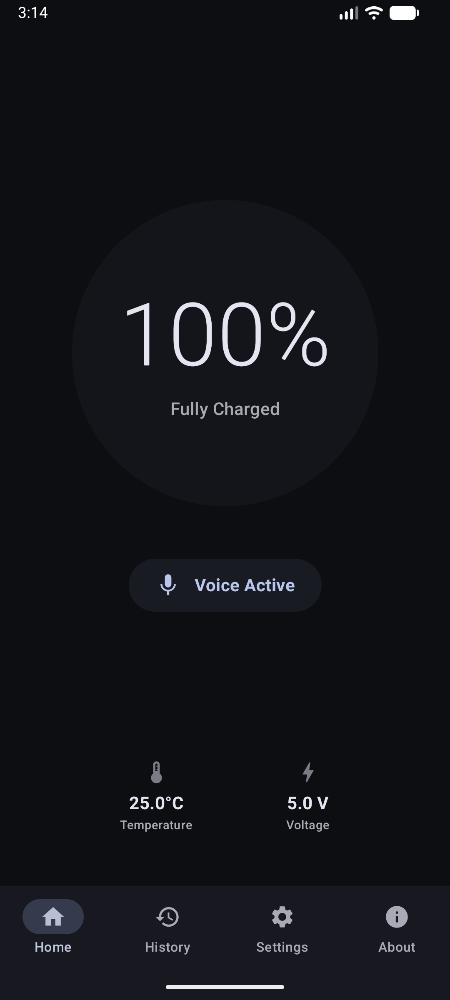
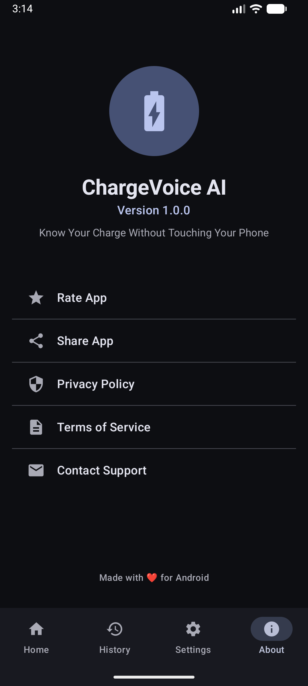

# ChargeVoice AI 🔋🎙️

**ChargeVoice AI** is a premium, open-source Android battery monitoring assistant. Instead of checking your screen, ChargeVoice intelligently tracks your charging progress in the background and uses native Text-To-Speech (TTS) to vocalize battery milestones, keeping you hands-free and protecting your battery health.

## 🚀 Download

You can download the latest signed APK directly from the releases page!

[⬇️ Download ChargeVoice AI (v1.0.0)](https://github.com/0xrohitsen/ChargeVoice-AI/releases/download/v1.0.0/ChargeVoice-AI-v1.0.0.apk)

> **Note**: Your phone may warn you about installing apps from unknown sources. This is an open-source project and completely safe! Just allow installation from your browser or file manager.

## 📱 Screenshots

  
  
  

## ✨ Features

- **🗣️ Vocal Milestones**: Automatically speaks when your battery hits specific milestones (e.g., 20%, 50%, 80%, 100%).
- **🔌 100% Full Charge Reminder**: Never overcharge again. When you hit 100%, the app will aggressively remind you to unplug your device every 2 minutes.
- **⚡ Background Worker**: Built on Android's modern `WorkManager`, ChargeVoice flawlessly monitors your battery even when the app is completely closed or swiped away.
- **🎨 Premium Material Design**: A beautiful, dynamic UI built entirely in Jetpack Compose that perfectly matches your system's dark/light themes.
- **⚙️ Ultimate Customization**: Adjust voice speed, pitch, language, notification preferences, and specific milestone triggers.

## 🛠️ Built With Modern Android

ChargeVoice AI is built using the latest Android development standards:
- **Language**: Kotlin
- **UI Toolkit**: Jetpack Compose (Material 3)
- **Dependency Injection**: Hilt / Dagger
- **Background Tasks**: WorkManager & Foreground Services
- **Local Storage**: DataStore Preferences
- **Architecture**: MVVM (Model-View-ViewModel)

## 💻 Building from Source

To build this project yourself:
1. Clone the repository: `git clone https://github.com/0xrohitsen/ChargeVoice-AI.git`
2. Open the project in **Android Studio**.
3. Let Gradle sync and download dependencies.
4. Run the app on your emulator or physical device.

## 🤝 Contributing

Contributions, issues, and feature requests are always welcome! Feel free to check the [issues page](https://github.com/0xrohitsen/ChargeVoice-AI/issues).

## 📄 License

This project is licensed under the MIT License - see the LICENSE file for details.
